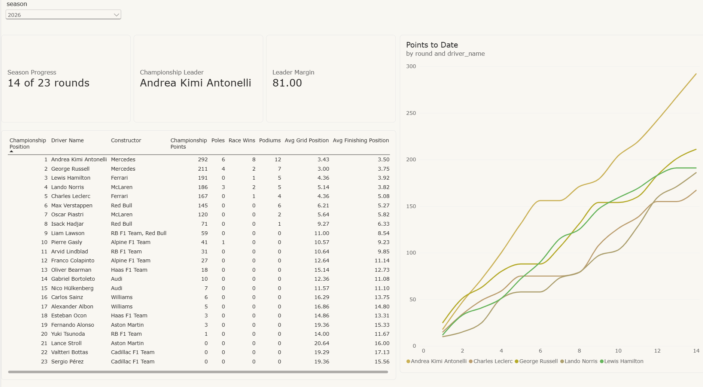
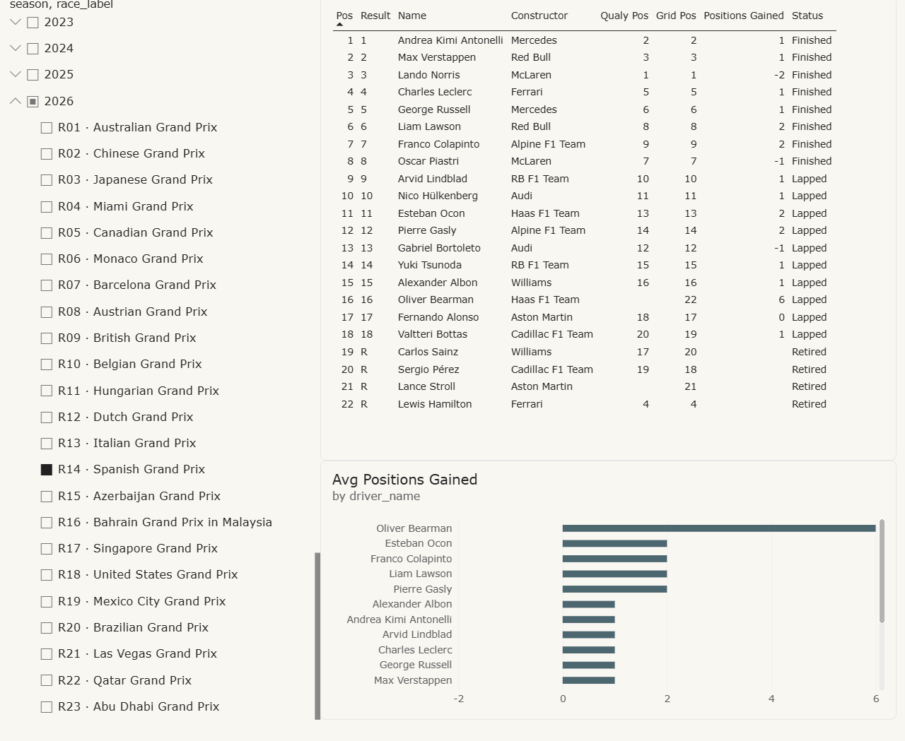
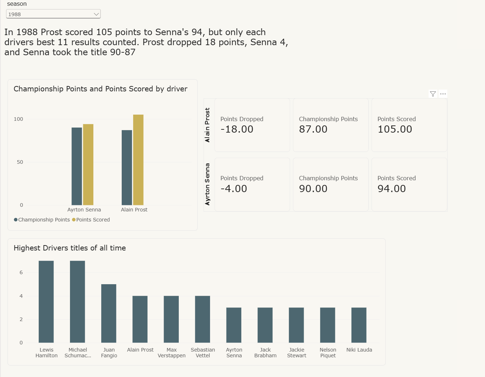
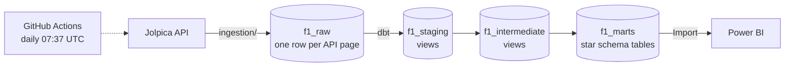

# F1 Data Hub

[](https://github.com/rhyshegyi/F1-Data-Hub/actions/workflows/pipeline.yml)

Every Formula 1 World Championship race since 1950, in a layered warehouse
that updates itself, with a Power BI report on top.

**Jolpica API → Databricks raw layer → dbt (staging → intermediate → marts) →
Power BI**, scheduled daily with GitHub Actions.



|                                               |                                                           |
| --------------------------------------------- | --------------------------------------------------------- |
|  |  |

---

## Why the layers exist

The obvious version of this project is one script: call the API, flatten the
JSON, write a table, point Power BI at it. This repo is a deliberate argument
against that, and each layer is here because the data forced it.

| Layer                  | Job                                    | What went wrong without it                                                                                                                                                                              |
| ---------------------- | -------------------------------------- | ------------------------------------------------------------------------------------------------------------------------------------------------------------------------------------------------------- |
| **Raw**          | Store each API page byte-for-byte      | Parsing bugs were found *after* loading: 2021 sprint weekends vanishing, a car number stored as the string `'None'`. Each fix was a model change and a rebuild, never a re-download of 77 seasons.   |
| **Staging**      | Parse and cast, one model per endpoint | Jolpica pages over result rows, not races, so one race can straddle two pages. Staging is the only place that knows the page layout, and it `try_cast`s everything so one bad value can't fail a load. |
| **Intermediate** | Logic that more than one mart needs    | Collapsing shared drives, joining sprint points onto race points and rolling-form windows live once, and are tested once, instead of being rewritten in every mart that needs them.                     |
| **Marts**        | A star schema shaped for Power BI      | Power BI can't join on two columns, can't import arrays and sorts text alphabetically. The marts absorb all of that, so the report does no modelling.                                                   |

**The report reads the marts layer only.**

---

## What the data turned up

Loading 77 seasons of results surfaced four things a single flat table would
have got quietly wrong. Each one is now a documented model decision and a test.

**Championship points aren't points scored.** Until 1990 only a driver's
best N results counted toward the title. In 1988 Prost scored 105 points to
Senna's 94, but after dropping his worst results he had 87 to Senna's 90, and
Senna was champion. So the marts keep `championship_points` (as published) and
`points_scored` (summed from results) side by side, with `points_dropped`
between them. Page 3 of the report is built on it.

**A driver can have two results in one race.** Until the mid-1960s drivers
could take over a teammate's car mid-race. At Monza in 1950 Ascari retired car
16, took over car 48 and finished second. That happens 83 times, and 130 cars
were shared by two drivers, so neither driver nor car identifies a result. The
results grain is `(season, round, driver, car number)`, and form metrics
collapse shared drives first so a driver isn't counted as racing twice.

**Results alone undercount points from 2021.** Sprint races award their own
points through a separate endpoint. Summing race results left 71 driver-seasons
short. In the 2021 finale that's the difference between Verstappen on 388.5 and
his real 395.5.

**Published standings have gaps on purpose.** Schumacher was disqualified
from the 1997 championship (`D`) and McLaren excluded from the 2007
constructors' title (`E`). Those rows have no position, so a `not_null` test is
the wrong check. Instead two invariants are tested: classified positions are
unique, and unclassified entries have none.

---

## How it runs



**Ingestion** (`ingestion/`, Python). Fetches seven endpoints (races,
results, qualifying, sprint results, drivers, driver and constructor
standings) and stores each page verbatim in a Delta table keyed
`(season, page_offset)`.

- A watermark table records which round each season was loaded up to, so a
  run fetches only what's new, and an interrupted backfill picks up where it
  stopped.
- Reloading a season deletes it and reinserts it, so stale and fresh pages
  never mix.
- Retries with backoff on 429 and on Cloudflare's 5xx responses, honours
  `Retry-After` and throttles below Jolpica's rate limit. The full backfill
  (77 seasons, 585 pages, about 42,000 rows) completed without a single 429.

**Transformation** (`dbt_project/`, dbt on Databricks). 7 staging models, 3
intermediate, 8 marts (4 dimensions, 4 facts).

- `persist_docs` writes every model and column description into Databricks as
  a comment, so the documentation is visible in the warehouse itself.

**Orchestration** (`.github/workflows/pipeline.yml`). Runs daily rather than
weekly because the race calendar has no fixed rhythm.

- On a day with no new race it costs one API call and writes nothing. When a
  race has finished it reloads the season and runs `dbt build`.
- A failing test fails the run.
- Can also be run manually to force-reload a season after a post-race penalty.

**Report** (`dashboard/`, Power BI Desktop). Import mode over the seven mart
tables, 8 relationships, 13 DAX measures and three pages. The
[build guide](dashboard/README.md) covers the model, every measure and a
table of figures to check the report against.

There's no live link because Power BI's free licence can't *Publish to web*.
The `.pbix` is committed and the screenshots above are from it.

---

## Testing

**123 dbt tests** run on every build: not-null, uniqueness and relationships
tests on every key, plus singular tests that check the marts against the
sport's own published numbers:

- From 1991, points summed from results must equal the published
  championship points for every driver in every season.
- The points-by-round fact and the standings fact reach season totals by
  different routes (one collapses shared drives first) and must agree for
  every season since 1950.
- Every finished season must have a sprint result for every scheduled sprint
  weekend.

These are the pipeline's alarm: if Jolpica ever publishes results and
standings that disagree, the scheduled run fails.

**183 Python tests** run offline against recorded Jolpica responses. The HTTP
transport, the retry sleep and the database cursor are all injected, so pagination,
retries, watermarking and parameter binding are tested without network or
warehouse access. One test fails any dbt description containing double quotes
or non-ASCII characters. Those broke Power BI's refresh with a misleading
*cyclic reference* error, because the Databricks connector reads the comments
`persist_docs` writes.

```bash
uv run pytest
uv run ruff check .
```

---

## Run it yourself

Requires Python 3.11–3.13, [uv](https://docs.astral.sh/uv/) and a Databricks
workspace. Free Edition is enough.

```bash
uv sync
```

1. Copy `.env.example` to `.env` and fill in the three credential lines: host
   and HTTP path from *SQL Warehouses → your warehouse → Connection details*,
   and a personal access token from *Settings → Developer*. Leave a credential
   line commented until you have its value, because an empty `DATABRICKS_TOKEN=`
   produces a misleading `auth_type=external-browser` error from dbt.
2. Check the connection:

   ```bash
   uv run dbt debug
   ```
3. Load history. It's resumable, so if you hit Jolpica's hourly limit, run it
   again:

   ```bash
   uv run python -m ingestion backfill --dry-run
   uv run python -m ingestion backfill
   ```
4. Build and test the models:

   ```bash
   uv run dbt deps
   uv run dbt build
   ```

After that, `uv run python -m ingestion incremental` keeps the current season
up to date. It's what the scheduled workflow runs, with repository secrets
`DATABRICKS_HOST`, `DATABRICKS_HTTP_PATH` and `DATABRICKS_TOKEN`.

---

## Repository layout

```
ingestion/          Python: Jolpica client, raw-layer writes, watermarks, CLI
dbt_project/
  models/staging/   one model per Jolpica endpoint
  models/intermediate/
  models/marts/     dim_* and fct_* tables for Power BI
  tests/            singular tests reconciling against published standings
  macros/           JSON schemas, lap-time parsing, race_id
dashboard/          Power BI report and its build guide
tests/              offline Python tests and recorded API fixtures
docs/               design spec
.github/workflows/  daily pipeline
```

Data from the [Jolpica F1 API](https://github.com/jolpica/jolpica-f1), the
community successor to the Ergast API.
