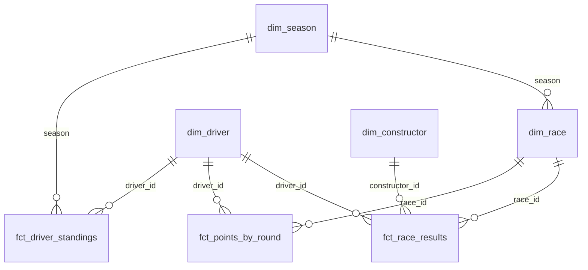

# Dashboard — Power BI

A three-page Power BI report over the `f1_marts` star schema. It's built in
Power BI Desktop (free) and shown in the main README as screenshots, with the
`.pbix` committed here.

**Why no live link:** Power BI's free licence can't *Publish to web*; that
needs Pro or Premium Per User. A Pro trial doesn't help either, because the
public embed stops working once its creator loses the licence, so a portfolio
link would break when the trial ends. The skill is in building the report
(model, DAX, visuals), and Desktop does all of that for free.

---

## 1. Connect

1. Open Power BI Desktop → **Get data** → search **Databricks** → pick
   **Databricks**, not *Azure Databricks*. This workspace runs on AWS.
2. **Server Hostname**: the `DATABRICKS_HOST` value from your `.env`.
   **HTTP Path**: the `DATABRICKS_HTTP_PATH` value.
3. **Data Connectivity mode: Import.** Not DirectQuery:
   - *Publish to web* doesn't support DirectQuery at all, so if you ever go
     live, Import is the only mode that works.
   - With DirectQuery, every visual on every page queries your Free Edition
     warehouse each time someone clicks.
   - The whole model is about 60k rows. Import holds it comfortably.
4. Authenticate with **Personal Access Token** and paste the token from `.env`.
   Power BI keeps it in its own local credential store.
5. In the Navigator, open `workspace` → `f1_marts` and tick **all seven
   tables**. Nothing from `f1_raw`, `f1_staging` or `f1_intermediate`; the
   report reads the marts layer only. That rule is the whole point of the
   layering.

If the first connection is slow, the serverless warehouse is starting up.
Give it a moment.

---

## 2. Model

### Relationships

Open **Model view**. Power BI auto-detects relationships by matching column
names. Check that you end up with exactly these eight, all *one-to-many*
with *single* cross-filter direction, and delete anything else it invents:

| From (one side) | To (many side) | On |
|---|---|---|
| `dim_season` | `dim_race` | `season` |
| `dim_season` | `fct_driver_standings` | `season` |
| `dim_race` | `fct_race_results` | `race_id` |
| `dim_race` | `fct_points_by_round` | `race_id` |
| `dim_driver` | `fct_race_results` | `driver_id` |
| `dim_driver` | `fct_points_by_round` | `driver_id` |
| `dim_driver` | `fct_driver_standings` | `driver_id` |
| `dim_constructor` | `fct_race_results` | `constructor_id` |



`race_id` is `season * 100 + round` (2024 round 21 is `202421`). It exists
because Power BI relationships can't join on two columns. The marts provide
it so the report doesn't have to compute it.

A season slicer on `dim_season` reaches race facts through `dim_race` and
standings directly. Each fact has exactly one path from the slicer, so nothing
is ambiguous. **Don't** add a relationship from `dim_season` straight to a race
fact. Power BI would have two routes and would silently deactivate one.

### Tidy-up

These are small, and they're what separates a considered model from a
default one:

- **Turn off Auto date/time.** *File* → *Options and settings* → *Options* →
  *Current file* → *Data Load* → untick **Auto date/time**. Otherwise Power BI
  quietly builds a hidden calendar table for every date column in the model
  (race dates, start times, dates of birth). Those are the
  `LocalDateTable_…` entries you'll see in refresh dialogs. They bloat the
  file and add refresh work, and this report never uses them: races are
  ordered by `race_id` and `round`, not by a calendar.
- **Hide every key column on the fact tables** (`race_id`, `driver_id`,
  `constructor_id`, `season` on the facts). Right-click → *Hide in report
  view*. Report authors should slice by dimension attributes, not fact keys.
- **Use `dim_race[race_label]` for race names in slicers and axes, not
  `race_name`.** It reads `R01 · Bahrain Grand Prix` and sorts in race order
  as it is, with nothing to configure. `race_name` can't be put in race
  order: *Sort by column* needs each value to map to exactly one sort key,
  and "British Grand Prix" appears in 77 seasons with 77 different `race_id`s
  (and different round numbers), so Power BI refuses. Hide `race_name` if
  you want to stop it being picked by accident.
- **Keep every measure in its own `_Measures` table**, so they live in one
  place instead of scattered across fact tables. Section 3 walks through
  making it.
- Set **Summarization: Don't summarize** on `dim_season[season]` and
  `dim_race[round]`, so Power BI stops offering to sum years.

---

## 3. Measures

Use explicit measures, never Power BI's implicit "Sum of…" aggregations.

### Make the measures table (once)

1. **Home → Enter data**. A small *Create Table* grid opens with one column,
   `Column1`.
2. Leave the grid empty. In the **Name** box at the bottom, type `_Measures`.
3. Click **Load**, not *Edit* or *Transform*.
4. `_Measures` appears in the **Data** pane on the right. The underscore
   sorts it to the top.

### Add a measure

1. In the **Data** pane, right-click `_Measures` → **New measure**.
2. The formula bar above the canvas shows `Measure = `. Select all of it and
   replace it with **one** measure from the list below: the name, the `=`,
   and everything after it.
3. Press **Enter** (or the ✓ beside the formula bar). The measure appears
   under `_Measures` with a calculator icon.

**Each code block below is exactly one measure. Paste one block at a time.**
For the multi-line ones, paste the whole block. The formula bar takes
several lines, and the ⌄ arrow on its right expands it so you can see them.

**Create them in the order listed.** Some measures use others (`Points to
Date` uses `[Total Points]`), and a measure that refers to one that doesn't
exist yet shows an error.

If a measure lands in the wrong table, click it in the Data pane →
**Measure tools** ribbon → **Home table** → `_Measures`.

Once `_Measures` has at least one measure, right-click `Column1` → **Hide in
report view**. With no visible columns left, Power BI treats `_Measures` as a
pure measures table and shows it with a calculator icon. The icon can take a
click elsewhere, or a save, to update.

### The measures

**1. Total Points**
```dax
Total Points = SUM ( fct_points_by_round[total_points] )
```
Race and sprint points combined. Use this, not `fct_race_results[points]`,
for anything about points scored. The race fact holds race points only and
falls short from 2021 onwards.

**2. Points to Date**
```dax
Points to Date =
VAR CurrentSeason = MAX ( dim_race[season] )
VAR CurrentRace   = MAX ( dim_race[race_id] )
RETURN
    CALCULATE (
        [Total Points],
        REMOVEFILTERS ( dim_race ),
        dim_race[season] = CurrentSeason,
        dim_race[race_id] <= CurrentRace
    )
```
The running total for the progression chart. `REMOVEFILTERS ( dim_race )`
clears the round on the axis (and, through the relationship, the season
slicer). The two conditions then put back "this season, up to this race".

Points as **published** versus points as **scored** (measures 3–5). They
differ before 1991, when only a driver's best N results counted toward the
title. That's what page 3 is built around.

**3. Championship Points**
```dax
Championship Points = SUM ( fct_driver_standings[championship_points] )
```

**4. Points Scored**
```dax
Points Scored = SUM ( fct_driver_standings[points_scored] )
```

**5. Points Dropped**
```dax
Points Dropped = SUM ( fct_driver_standings[points_dropped] )
```

**6. Wins**
```dax
Wins = CALCULATE ( COUNTROWS ( fct_race_results ), fct_race_results[is_win] = TRUE () )
```

**7. Podiums**
```dax
Podiums = CALCULATE ( COUNTROWS ( fct_race_results ), fct_race_results[is_podium] = TRUE () )
```

**8. Races Entered**
```dax
Races Entered = DISTINCTCOUNT ( fct_race_results[race_id] )
```
Counts distinct races rather than rows. A 1950s driver who took over a second
car mid-race has two result rows for one race.

**9. Avg Positions Gained**
```dax
Avg Positions Gained = AVERAGE ( fct_race_results[positions_gained] )
```

**10. Titles**
```dax
Titles = CALCULATE ( COUNTROWS ( fct_driver_standings ), fct_driver_standings[is_champion] = TRUE () )
```

**11. Championship Leader** (needs measure 3)
```dax
Championship Leader =
VAR Leader =
    TOPN ( 1, VALUES ( dim_driver[driver_name] ), [Championship Points], DESC )
RETURN
    CONCATENATEX ( Leader, dim_driver[driver_name], ", " )
```
Ranks drivers by a measure rather than filtering on `championship_position = 1`.
A filter on the fact table doesn't flow back to `dim_driver` (relationships
are single-direction), so that version would return every driver's name.
`CONCATENATEX` handles a tie at the top.

**12. Leader Margin** (needs measure 3)
```dax
Leader Margin =
VAR TopTwo = TOPN ( 2, VALUES ( dim_driver[driver_name] ), [Championship Points], DESC )
RETURN
    MAXX ( TopTwo, [Championship Points] ) - MINX ( TopTwo, [Championship Points] )
```

**13. Season Progress**
```dax
Season Progress =
SUM ( dim_season[races_completed] ) & " of " & SUM ( dim_season[races_scheduled] ) & " rounds"
```

---

## 4. Pages

### Page 1 — Season Overview

- **Slicer:** `dim_season[season]`, dropdown, *single select*.
- **Cards:** `[Season Progress]`, `[Championship Leader]`, `[Leader Margin]`.
- **Standings table:** `fct_driver_standings[championship_position]`,
  `dim_driver[driver_name]`, `fct_driver_standings[constructor_names]`,
  `[Championship Points]`, `[Wins]`, `[Podiums]`. Sort by position.
- **Points progression (line chart):** X-axis `dim_race[round]`, Y-axis
  `[Points to Date]`, Legend `dim_driver[driver_name]`.
  - Visual filter on `dim_driver[driver_name]`: **Top N = 5 by
    `[Championship Points]`**. Twenty lines is spaghetti.
  - Visual filter on `dim_race[has_results]` = **True**. Without it, rounds
    not yet run draw as a flat line to the end of the season.

### Page 2 — Race Weekend

- **Slicers:** `dim_season[season]` and `dim_race[race_label]`. Filtered by
  the season slicer, it lists that season's races in round order.
- **Result table:** `fct_race_results[finish_position_text]`,
  `dim_driver[driver_name]`, `dim_constructor[constructor_name]`,
  `fct_race_results[qualifying_position]`, `fct_race_results[grid_position]`,
  `fct_race_results[positions_gained]`, `fct_race_results[status]`.
  Set each numeric column to **Don't summarize** in the visual. Power BI
  defaults to *Sum*, which is harmless for one row per driver but quietly adds
  together the two rows a 1950s shared drive produces.
- **Positions gained (clustered bar):** `dim_driver[driver_name]` by
  `[Avg Positions Gained]`, sorted descending. Qualifying and grid differ
  when there are penalties, and `grid_penalty_positions` shows by how much.
  Qualifying data starts in 1994.

### Page 3 — The Best-Results Era

The page with the story. Before 1991 only a driver's best N results counted,
so the most points didn't always win the title.

- **Slicer:** `dim_season[season]`, defaulting to **1988**.
- **Clustered column:** `dim_driver[driver_name]` with `[Championship Points]`
  and `[Points Scored]` side by side, filtered to championship positions 1–3.
- **Card or table:** `[Points Dropped]` per driver.
- **Text box:** one or two sentences. *"In 1988 Prost scored 105 points to
  Senna's 94, but only each driver's best 11 results counted. Prost dropped 18
  points, Senna 4, and Senna took the title 90–87."*
- **Titles by driver (bar):** `dim_driver[driver_name]` by `[Titles]`, Top 10,
  with the season slicer's interaction turned off for this visual.

---

## 5. Check your numbers

Your report should show exactly these figures. They come straight from the
marts, which are tested against the published championship results. If a
visual disagrees, the measure or a relationship is wrong, not the data.

| Where | Filter | Should show |
|---|---|---|
| Page 1 cards | 2026 | `13 of 23 rounds` · Leader **Andrea Kimi Antonelli** · Margin **66** |
| Page 1 standings | 2026 | Antonelli 267, Russell 201, Hamilton 191 |
| Page 1 progression | 2021, round 21 | Verstappen **369.5**, Hamilton **369.5**: level going into the finale |
| Page 1 progression | 2021, round 22 | Verstappen **395.5**, Hamilton **387.5** |
| Page 3 | 1988 | Senna: championship **90**, scored **94**. Prost: championship **87**, scored **105**, dropped **18** |
| Page 3 | 1964 | Surtees: championship **40**, scored **40**. Hill: championship **39**, scored **41** |
| Page 3 titles | (any) | Hamilton 7, Schumacher 7, Fangio 5, Prost 4, Verstappen 4 |

The 2026 figures are as of round 13 and change after each race.

The 2021 round-22 row is the one to watch. If Verstappen shows **388.5**, the
progression chart is built on `fct_race_results[points]` and is missing his 7
sprint points. Switch it to `[Total Points]`.

---

## 6. Keep it current

The pipeline keeps the warehouse up to date. To pull new races into the
report, open the `.pbix` and click **Home → Refresh**. That's the whole
refresh process in Desktop.

### If refresh fails with "A cyclic reference was encountered during evaluation"

The cause is most likely a **column or table description** in dbt, not the
report. `persist_docs` writes every dbt description into Databricks as a
comment, and the Databricks connector reads those comments. A description
containing double quotes and a non-ASCII character (`"R01 · Bahrain Grand
Prix"`) broke `dim_race` with exactly this error, even though its query was
nothing but the connector's own navigation steps. Rewriting that one
description in plain ASCII fixed it, with nothing else changed.

`tests/test_dbt_docs.py` now fails on any persisted description containing
double quotes or non-ASCII characters, so this shouldn't recur. The *data* is
unaffected: values like `São Paulo` and the `·` in `race_label` load fine.
Only the comments matter.

## 7. Before committing the `.pbix`

Save it as `dashboard/f1_data_hub.pbix`, **but ask for it to be checked before
the first commit.** In Import mode the file holds the data (public F1 results,
fine to publish) and the workspace hostname and HTTP path. The access token
should live only in Power BI's local credential store, not in the file. That's
worth confirming by opening the file up before it goes into a public repo.
