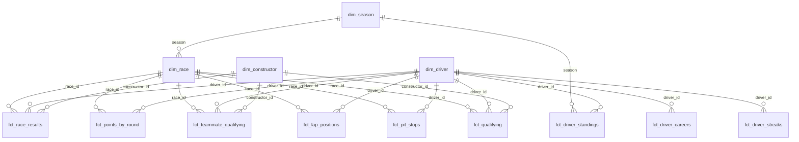

# Dashboard — Power BI

A four-page Power BI report over the `f1_marts` star schema. It's built in
Power BI Desktop (free) and shown in the main README as screenshots, with the
`.pbix` committed here.

**Why no live link:** Power BI's free licence can't *Publish to web*; that
needs Pro or Premium Per User. A Pro trial doesn't help either, because the
public embed stops working once its creator loses the licence, so a portfolio
link would break when the trial ends. The skill is in building the report
(model, DAX, visuals), and Desktop does all of that for free.

---

## 1. Connect

1. Open Power BI Desktop → **Get data** → search **Databricks** → pick
   **Databricks**, not *Azure Databricks*. This workspace runs on AWS.
2. **Server Hostname**: the `DATABRICKS_HOST` value from your `.env`.
   **HTTP Path**: the `DATABRICKS_HTTP_PATH` value.
3. **Data Connectivity mode: Import.** Not DirectQuery:
   - *Publish to web* doesn't support DirectQuery at all, so if you ever go
     live, Import is the only mode that works.
   - With DirectQuery, every visual on every page queries your Free Edition
     warehouse each time someone clicks.
   - The model is small: tens of thousands of rows per table. Import holds it
     comfortably.
4. Authenticate with **Personal Access Token** and paste the token from `.env`.
   Power BI keeps it in its own local credential store.
5. In the Navigator, open `workspace` → `f1_marts` and tick **all thirteen
   tables**. Nothing from `f1_raw`, `f1_staging` or `f1_intermediate`; the
   report reads the marts layer only. That rule is the whole point of the
   layering.

If the first connection is slow, the serverless warehouse is starting up.
Give it a moment.

---

## 2. Model

### Relationships

Open **Model view**. Power BI auto-detects relationships by matching column
names. Check that you end up with exactly these twenty, all *one-to-many*
with *single* cross-filter direction, and delete anything else it invents:

| From (one side) | To (many side) | On |
|---|---|---|
| `dim_season` | `dim_race` | `season` |
| `dim_season` | `fct_driver_standings` | `season` |
| `dim_race` | `fct_race_results` | `race_id` |
| `dim_race` | `fct_points_by_round` | `race_id` |
| `dim_driver` | `fct_race_results` | `driver_id` |
| `dim_driver` | `fct_points_by_round` | `driver_id` |
| `dim_driver` | `fct_driver_standings` | `driver_id` |
| `dim_constructor` | `fct_race_results` | `constructor_id` |
| `dim_race` | `fct_teammate_qualifying` | `race_id` |
| `dim_driver` | `fct_teammate_qualifying` | `driver_id` |
| `dim_constructor` | `fct_teammate_qualifying` | `constructor_id` |
| `dim_driver` | `fct_driver_careers` | `driver_id` |
| `dim_driver` | `fct_driver_streaks` | `driver_id` |
| `dim_race` | `fct_lap_positions` | `race_id` |
| `dim_driver` | `fct_lap_positions` | `driver_id` |
| `dim_race` | `fct_pit_stops` | `race_id` |
| `dim_driver` | `fct_pit_stops` | `driver_id` |
| `dim_race` | `fct_qualifying` | `race_id` |
| `dim_driver` | `fct_qualifying` | `driver_id` |
| `dim_constructor` | `fct_qualifying` | `constructor_id` |



`fct_driver_careers` has one row per driver, so Power BI detects the
relationship as **One to one** and makes it filter in both directions. Open it
(double-click the line in Model view) and change **Cardinality** to **Many to
one (\*:1)** from `fct_driver_careers` to `dim_driver`, with **Cross filter
direction: Single**, to match the rest of the model.

`fct_teammate_qualifying` joins to `dim_driver` on the driver only. The
teammate's name is a plain column on the fact (`teammate_name`). A second
relationship from `teammate_id` to `dim_driver` would have to be inactive,
because Power BI allows only one active path between two tables, and every
visual would then need `USERELATIONSHIP` just to show a name. **Don't** create
one, and hide `teammate_id`.

`race_id` is `season * 100 + round` (2024 round 21 is `202421`). It exists
because Power BI relationships can't join on two columns. The marts provide
it so the report doesn't have to compute it.

A season slicer on `dim_season` reaches race facts through `dim_race` and
standings directly. Each fact has exactly one path from the slicer, so nothing
is ambiguous. **Don't** add a relationship from `dim_season` straight to a race
fact. Power BI would have two routes and would silently deactivate one.

### Tidy-up

These are small, and they're what separates a considered model from a
default one:

- **Turn off Auto date/time.** *File* → *Options and settings* → *Options* →
  *Current file* → *Data Load* → untick **Auto date/time**. Otherwise Power BI
  quietly builds a hidden calendar table for every date column in the model
  (race dates, start times, dates of birth). Those are the
  `LocalDateTable_…` entries you'll see in refresh dialogs. They bloat the
  file and add refresh work, and this report never uses them: races are
  ordered by `race_id` and `round`, not by a calendar.
- **Hide every key column on the fact tables** (`race_id`, `driver_id`,
  `constructor_id`, `season` on the facts). Right-click → *Hide in report
  view*. Report authors should slice by dimension attributes, not fact keys.
- **Use `dim_race[race_label]` for race names in slicers and axes, not
  `race_name`.** It reads `R01 · Bahrain Grand Prix` and sorts in race order
  as it is, with nothing to configure. `race_name` can't be put in race
  order: *Sort by column* needs each value to map to exactly one sort key,
  and "British Grand Prix" appears in 77 seasons with 77 different `race_id`s
  (and different round numbers), so Power BI refuses. Hide `race_name` if
  you want to stop it being picked by accident.
- **Keep every measure in its own `_Measures` table**, so they live in one
  place instead of scattered across fact tables. Section 3 walks through
  making it.
- Set **Summarization: Don't summarize** on `dim_season[season]` and
  `dim_race[round]`, so Power BI stops offering to sum years.

---

## 3. Measures

Use explicit measures, never Power BI's implicit "Sum of…" aggregations.

### Make the measures table (once)

1. **Home → Enter data**. A small *Create Table* grid opens with one column,
   `Column1`.
2. Leave the grid empty. In the **Name** box at the bottom, type `_Measures`.
3. Click **Load**, not *Edit* or *Transform*.
4. `_Measures` appears in the **Data** pane on the right. The underscore
   sorts it to the top.

### Add a measure

1. In the **Data** pane, right-click `_Measures` → **New measure**.
2. The formula bar above the canvas shows `Measure = `. Select all of it and
   replace it with **one** measure from the list below: the name, the `=`,
   and everything after it.
3. Press **Enter** (or the ✓ beside the formula bar). The measure appears
   under `_Measures` with a calculator icon.

**Each code block below is exactly one measure. Paste one block at a time.**
For the multi-line ones, paste the whole block. The formula bar takes
several lines, and the ⌄ arrow on its right expands it so you can see them.

**Create them in the order listed.** Some measures use others (`Points to
Date` uses `[Total Points]`), and a measure that refers to one that doesn't
exist yet shows an error.

If a measure lands in the wrong table, click it in the Data pane →
**Measure tools** ribbon → **Home table** → `_Measures`.

Once `_Measures` has at least one measure, right-click `Column1` → **Hide in
report view**. With no visible columns left, Power BI treats `_Measures` as a
pure measures table and shows it with a calculator icon. The icon can take a
click elsewhere, or a save, to update.

### The measures

**1. Total Points**
```dax
Total Points = SUM ( fct_points_by_round[total_points] )
```
Race and sprint points combined. Use this, not `fct_race_results[points]`,
for anything about points scored. The race fact holds race points only and
falls short from 2021 onwards.

**2. Points to Date**
```dax
Points to Date =
VAR CurrentSeason = MAX ( dim_race[season] )
VAR CurrentRace   = MAX ( dim_race[race_id] )
RETURN
    CALCULATE (
        [Total Points],
        REMOVEFILTERS ( dim_race ),
        dim_race[season] = CurrentSeason,
        dim_race[race_id] <= CurrentRace
    )
```
The running total for the progression chart. `REMOVEFILTERS ( dim_race )`
clears the round on the axis (and, through the relationship, the season
slicer). The two conditions then put back "this season, up to this race".

Points as **published** versus points as **scored** (measures 3–5). They
differ before 1991, when only a driver's best N results counted toward the
title. That's what page 3 is built around.

**3. Championship Points**
```dax
Championship Points = SUM ( fct_driver_standings[championship_points] )
```

**4. Points Scored**
```dax
Points Scored = SUM ( fct_driver_standings[points_scored] )
```

**5. Points Dropped**
```dax
Points Dropped = SUM ( fct_driver_standings[points_dropped] )
```

**6. Wins**
```dax
Wins = CALCULATE ( COUNTROWS ( fct_race_results ), fct_race_results[is_win] = TRUE () )
```

**7. Podiums**
```dax
Podiums = CALCULATE ( COUNTROWS ( fct_race_results ), fct_race_results[is_podium] = TRUE () )
```

**8. Races Entered**
```dax
Races Entered = DISTINCTCOUNT ( fct_race_results[race_id] )
```
Counts distinct races rather than rows. A 1950s driver who took over a second
car mid-race has two result rows for one race.

**9. Avg Positions Gained**
```dax
Avg Positions Gained = AVERAGE ( fct_race_results[positions_gained] )
```

**10. Titles**
```dax
Titles = CALCULATE ( COUNTROWS ( fct_driver_standings ), fct_driver_standings[is_champion] = TRUE () )
```

**11. Championship Leader** (needs measure 3)
```dax
Championship Leader =
VAR Leader =
    TOPN ( 1, VALUES ( dim_driver[driver_name] ), [Championship Points], DESC )
RETURN
    CONCATENATEX ( Leader, dim_driver[driver_name], ", " )
```
Ranks drivers by a measure rather than filtering on `championship_position = 1`.
A filter on the fact table doesn't flow back to `dim_driver` (relationships
are single-direction), so that version would return every driver's name.
`CONCATENATEX` handles a tie at the top.

**12. Leader Margin** (needs measure 3)
```dax
Leader Margin =
VAR TopTwo = TOPN ( 2, VALUES ( dim_driver[driver_name] ), [Championship Points], DESC )
RETURN
    MAXX ( TopTwo, [Championship Points] ) - MINX ( TopTwo, [Championship Points] )
```

**13. Season Progress**
```dax
Season Progress =
SUM ( dim_season[races_completed] ) & " of " & SUM ( dim_season[races_scheduled] ) & " rounds"
```

Measures 14–19 are for page 3, Teammate Battles. Each row of
`fct_teammate_qualifying` is one driver compared with their teammate in one
qualifying session, measured in the last session both set a time in.

**14. Qualifying Sessions**
```dax
Qualifying Sessions = COUNTROWS ( fct_teammate_qualifying )
```

**15. Quali H2H Wins**
```dax
Quali H2H Wins = CALCULATE ( COUNTROWS ( fct_teammate_qualifying ), fct_teammate_qualifying[beat_teammate] = TRUE () )
```

**16. Quali H2H Losses**
```dax
Quali H2H Losses = CALCULATE ( COUNTROWS ( fct_teammate_qualifying ), fct_teammate_qualifying[beat_teammate] = FALSE () )
```

**17. Qualifying Head-to-Head** (needs measures 14–16)
```dax
Qualifying Head-to-Head =
IF (
    [Qualifying Sessions] > 0,
    FORMAT ( [Quali H2H Wins] + 0, "0" ) & "–" & FORMAT ( [Quali H2H Losses] + 0, "0" )
)
```
The `IF` matters. Without it the measure returns `0–0` for pairings that never
happened. A table visual shows every combination of its columns that a measure
returns a value for, so the page would list every driver against every
teammate name and team in the model.

**18. Median Gap %**
```dax
Median Gap % = DIVIDE ( MEDIAN ( fct_teammate_qualifying[gap_pct] ), 100 )
```
Then **Measure tools → Format → Percentage**, and type a custom format of
`0.000%` so small gaps don't all round to `0.00%`. Negative means the driver
was faster than their teammate.

A median rather than an average: one crash or aborted lap can put a driver 20%
down in a session. Verstappen's 2023 average gap to Pérez is 4.2%; the median
is 0.6%, which is the real picture.

**19. Median Gap (s)**
```dax
Median Gap (s) = MEDIAN ( fct_teammate_qualifying[gap_seconds] )
```
Format it as a decimal number with **3** decimal places. Negative means the
driver was faster. Seconds read more naturally (*0.2 s a lap*), but a tenth at
Monaco is a bigger margin than a tenth at Spa, so keep `[Median Gap %]` as the
column to sort by.

Measures 20 and 21 colour the Team cell. The colours live in
`dim_constructor[team_colour]` and `[text_colour]`, loaded from
`dbt_project/seeds/team_colours.csv`, one colour per team since 1994.

**20. Team Colour**
```dax
Team Colour = SELECTEDVALUE ( dim_constructor[team_colour], "#9E9E9E" )
```

**21. Team Text Colour**
```dax
Team Text Colour = SELECTEDVALUE ( dim_constructor[text_colour], "#000000" )
```
Each team has black or white text, whichever reads better on its colour, so
Tyrrell's navy and Minardi's black stay readable.

Measures 22–30 are for page 4, Records. Measure 22 needs the **Minimum
Starts** parameter from page 4's setup, so make that first.

**22. Meets Minimum Starts**
```dax
Meets Minimum Starts = IF ( SUM ( fct_driver_careers[starts] ) >= [Minimum Starts Value], 1, 0 )
```
A visual filter on this keeps drivers below the threshold out of the career
leaderboard. Without one, 1950s Indianapolis 500 entrants top every rate:
the Indy 500 counted toward the championship until 1960, so several drivers
have one start and one win.

**23. Season Win Rate**
```dax
Season Win Rate = DIVIDE ( SUM ( fct_driver_standings[race_wins] ), SUM ( fct_driver_standings[races_entered] ) )
```

**24. Season Modern Pts per Start**
```dax
Season Modern Pts per Start = DIVIDE ( SUM ( fct_driver_standings[modern_points] ), SUM ( fct_driver_standings[races_entered] ) )
```

Measures 25–30 are the age record cards. Each finds the record holder across
all drivers (`ALL` ignores any filters on the page), and shows the name with
the age as F1 quotes it, like `18y 228d`. `CONCATENATEX` lists both drivers if
two ever share a record.

**25. Youngest Winner**
```dax
Youngest Winner =
VAR Holder =
    TOPN ( 1, FILTER ( ALL ( fct_driver_careers ), NOT ISBLANK ( fct_driver_careers[age_first_win_days] ) ),
        fct_driver_careers[age_first_win_days], ASC )
RETURN
    CONCATENATEX ( Holder, RELATED ( dim_driver[driver_name] ) & " – " & fct_driver_careers[age_first_win], ", " )
```

**26. Oldest Winner**
```dax
Oldest Winner =
VAR Holder =
    TOPN ( 1, FILTER ( ALL ( fct_driver_careers ), NOT ISBLANK ( fct_driver_careers[age_last_win_days] ) ),
        fct_driver_careers[age_last_win_days], DESC )
RETURN
    CONCATENATEX ( Holder, RELATED ( dim_driver[driver_name] ) & " – " & fct_driver_careers[age_last_win], ", " )
```

**27. Youngest Podium**
```dax
Youngest Podium =
VAR Holder =
    TOPN ( 1, FILTER ( ALL ( fct_driver_careers ), NOT ISBLANK ( fct_driver_careers[age_first_podium_days] ) ),
        fct_driver_careers[age_first_podium_days], ASC )
RETURN
    CONCATENATEX ( Holder, RELATED ( dim_driver[driver_name] ) & " – " & fct_driver_careers[age_first_podium], ", " )
```

**28. Oldest Podium**
```dax
Oldest Podium =
VAR Holder =
    TOPN ( 1, FILTER ( ALL ( fct_driver_careers ), NOT ISBLANK ( fct_driver_careers[age_last_podium_days] ) ),
        fct_driver_careers[age_last_podium_days], DESC )
RETURN
    CONCATENATEX ( Holder, RELATED ( dim_driver[driver_name] ) & " – " & fct_driver_careers[age_last_podium], ", " )
```

**29. Youngest Champion**
```dax
Youngest Champion =
VAR Holder =
    TOPN ( 1, FILTER ( ALL ( fct_driver_careers ), NOT ISBLANK ( fct_driver_careers[age_first_title_days] ) ),
        fct_driver_careers[age_first_title_days], ASC )
RETURN
    CONCATENATEX ( Holder, RELATED ( dim_driver[driver_name] ) & " – " & fct_driver_careers[age_first_title], ", " )
```

**30. Oldest Champion**
```dax
Oldest Champion =
VAR Holder =
    TOPN ( 1, FILTER ( ALL ( fct_driver_careers ), NOT ISBLANK ( fct_driver_careers[age_last_title_days] ) ),
        fct_driver_careers[age_last_title_days], DESC )
RETURN
    CONCATENATEX ( Holder, RELATED ( dim_driver[driver_name] ) & " – " & fct_driver_careers[age_last_title], ", " )
```
A title's age is the driver's age at that season's final race.

Measures 31–36 are for the position chart and pit stops on page 2. Measure 34
needs the **Drivers Shown** parameter from page 2's setup, so make that first.

**31. Lap Position**
```dax
Lap Position = MIN ( fct_lap_positions[position] )
```

**32. Finish Position**
```dax
Finish Position = MIN ( fct_race_results[finish_position] )
```

**33. Finish Rank** (needs measure 32)
```dax
Finish Rank =
IF (
    NOT ISBLANK ( [Finish Position] ),
    RANKX (
        FILTER ( ALLSELECTED ( dim_driver[driver_name] ), NOT ISBLANK ( [Finish Position] ) ),
        [Finish Position], , ASC, DENSE
    )
)
```
Ranks the drivers in the selected race by where they finished. The `FILTER`
keeps the other 800-odd drivers in `dim_driver`, who weren't in the race, out
of the ranking.

**34. Show Driver** (needs measure 33)
```dax
Show Driver = IF ( [Finish Rank] <= [Drivers Shown Value], 1, 0 )
```

**35. Chart Position** (needs measures 31 and 34)
```dax
Chart Position = IF ( [Show Driver] = 1, [Lap Position] )
```
Blank for drivers outside the top N, so they draw no line. Change the Drivers
Shown slider to 3 or 10 and the chart follows, for any race, without picking
names by hand.

**36. Lap Data Note**
```dax
Lap Data Note =
SWITCH (
    TRUE (),
    ISBLANK ( COUNTROWS ( fct_lap_positions ) ), "Lap-by-lap positions start in 1996",
    ISBLANK ( COUNTROWS ( fct_pit_stops ) ), "Pit stop data starts in 2011",
    BLANK ()
)
```

Measures 37–39 are for the fastest lap and qualifying table on page 2.

**37. Fastest Lap**
```dax
Fastest Lap =
VAR FastestRow = FILTER ( fct_race_results, fct_race_results[is_fastest_lap] = TRUE () )
RETURN
    SWITCH (
        COUNTROWS ( FastestRow ) + 0,
        1, MAXX (
            FastestRow,
            RELATED ( dim_driver[driver_name] ) & " – " & fct_race_results[fastest_lap_time]
                & " (lap " & fct_race_results[fastest_lap_number] & ")"
        ),
        0, "Fastest laps are recorded from 2004",
        BLANK ()
    )
```
Reads like `Max Verstappen – 1:32.608 (lap 39)`. The `+ 0` matters:
`COUNTROWS` of an empty table is blank, not 0, so without it older races would
show nothing instead of the note.

**38. Fastest Lap Highlight**
```dax
Fastest Lap Highlight =
IF (
    CALCULATE ( COUNTROWS ( fct_race_results ), fct_race_results[is_fastest_lap] = TRUE () ) > 0,
    "#B138DD"
)
```
F1's purple for the fastest lap, blank for everyone else.

**39. Qualifying Data Note**
```dax
Qualifying Data Note = IF ( ISBLANK ( COUNTROWS ( fct_qualifying ) ), "Qualifying data starts in 1994" )
```

---

## 4. Pages

### Page 1 — Season Overview

- **Slicer:** `dim_season[season]`, dropdown, *single select*.
- **Cards:** `[Season Progress]`, `[Championship Leader]`, `[Leader Margin]`.
- **Standings table:** `fct_driver_standings[championship_position]`,
  `dim_driver[driver_name]`, `fct_driver_standings[constructor_names]`,
  `[Championship Points]`, `[Wins]`, `[Podiums]`. Sort by position.
  `fct_driver_standings[poles]` counts starts from grid slot 1, the same
  definition the Records page uses, so every season since 1950 has poles
  (qualifying data only starts in 1994). It can differ from the qualifying
  pole when a grid penalty moved the fastest qualifier back.
- **Points progression (line chart):** X-axis `dim_race[round]`, Y-axis
  `[Points to Date]`, Legend `dim_driver[driver_name]`.
  - Visual filter on `dim_driver[driver_name]`: **Top N = 5 by
    `[Championship Points]`**. Twenty lines is spaghetti.
  - Visual filter on `dim_race[has_results]` = **True**. Without it, rounds
    not yet run draw as a flat line to the end of the season.

### Page 2 — Race Weekend

- **Slicers:** `dim_season[season]` and `dim_race[race_label]`. Filtered by
  the season slicer, it lists that season's races in round order.
- **Result table:** `fct_race_results[finish_position]`,
  `fct_race_results[finish_position_text]`, `dim_driver[driver_name]`,
  `dim_constructor[constructor_name]`,
  `fct_race_results[qualifying_position]`, `fct_race_results[grid_position]`,
  `fct_race_results[positions_gained]`, `fct_race_results[status]`.
  - **Sort by `finish_position`** (click its header until it sorts ascending).
    `finish_position_text` is text, so it sorts 1, 10, 11, 2... and *Sort by
    column* can't fix it: every retirement is `R` but has its own numeric
    position, and Sort by column needs one sort value per text value.
    Rename `finish_position` to **Pos** and `finish_position_text` to
    **Result** in the visual (double-click the field in the Columns well).
  - Set each numeric column to **Don't summarize**: in the Visualizations
    pane's Columns well, click the arrow next to the field and pick
    *Don't summarize*. Text fields don't have the option. Power BI defaults to
    *Sum*, which is harmless for one row per driver but quietly adds together
    the two rows a 1950s shared drive produces.
- **Positions gained (clustered bar):** `dim_driver[driver_name]` by
  `[Avg Positions Gained]`, sorted descending. Qualifying and grid differ
  when there are penalties, and `grid_penalty_positions` shows by how much.
  Qualifying data starts in 1994.
- **Drivers Shown parameter:** **Modeling → New parameter → Numeric range**.
  Name `Drivers Shown`, minimum `1`, maximum `25`, increment `1`, default `5`,
  with **Add slicer to this page** ticked. This creates `[Drivers Shown Value]`
  for measure 34.
- **Position chart (line chart):** X-axis `fct_lap_positions[lap]`, Y-axis
  `[Chart Position]`, Legend `dim_driver[driver_name]`.
  - **Put P1 at the top:** **Format → Y-axis → Range → Invert range: On**, and
    set the minimum to 1.
  - **X-axis type: Continuous** (**Format → X-axis → Type**), so laps space
    evenly. Lap 0 is the starting grid.
  - **Line colours** can't come from data, so they don't follow team colours
    automatically. Set them per driver under **Format → Lines → Colors** if
    you want them to, for the race you screenshot.
- **Pit stops (table):** `dim_driver[driver_name]`,
  `fct_pit_stops[stop_number]` (**Stop**), `[lap]` (**Lap**),
  `[duration_seconds]` (**Pit lane (s)**), all numeric fields **Don't
  summarize**.
  - **Visual filter:** `[Show Driver]` **is 1**, so it lists stops for the
    same drivers as the chart.
  - **Sort** by Lap, ascending, to read the race's strategy in order.
- **Card:** `[Lap Data Note]`. It's blank for a modern race and explains an
  empty chart or table for older ones.
- **Qualifying (table):** `fct_qualifying[qualifying_position]` (**Pos**),
  `dim_driver[driver_name]`, `dim_constructor[constructor_name]` (**Team**),
  `fct_qualifying[q1_time]` (**Q1**), `[q2_time]` (**Q2**), `[q3_time]`
  (**Q3**), `[gap_seconds]` (**Gap**), `[grid_position]` (**Grid**).
  - Numeric fields **Don't summarize**. Format Gap with 3 decimal places
    (**Column tools → Format**).
  - **Gap is measured within the driver's last session:** the gap to pole for
    anyone who reached Q3, and to the fastest Q1 or Q2 lap for drivers knocked
    out there. Laps from different sessions don't compare: in 2008 and 2009 Q3
    was run on race fuel, and a wet Q3 is seconds slower than a dry Q1.
  - **Sort** by Pos, ascending.
  - **Colour the Team cell** the same way as on Teammate Battles (measures 20
    and 21).
  - Pos and Grid differ when a driver took a grid penalty. A blank Grid means
    the driver qualified but didn't start.
  - Before 2006 there was one session, and its time appears under Q1. The
    exception is the first six races of 2005, where pole went to the lowest
    total of a Saturday lap (Q1) and a Sunday lap (Q2), and Gap compares those
    totals.
- **Card:** `[Qualifying Data Note]`, blank from 1994.
- **Fastest lap (card):** `[Fastest Lap]`.
  - Optional: add `fct_race_results[fastest_lap_time]` (**Fastest Lap**) to the
    result table, and colour its background with **Conditional formatting →
    Background color → Field value → `Fastest Lap Highlight`**, so the fastest
    lap shows in purple in the result table too.

### Page 3 — Teammate Battles

Your teammate is the only driver in the same car, so qualifying against them
is the cleanest comparison of drivers there is. Data starts in 1994.

- **Slicer:** `dim_season[season]`, dropdown, *single select*.
- **Table:** `dim_driver[driver_name]` (rename **Driver**),
  `fct_teammate_qualifying[teammate_name]` (**Teammate**),
  `dim_constructor[constructor_name]` (**Team**), `[Qualifying Sessions]`,
  `[Qualifying Head-to-Head]`, `[Median Gap (s)]`, `[Median Gap %]`. Sort by `[Median Gap %]`
  ascending, so the most dominant driver is at the top.
  - Every pairing appears twice, once from each driver's side, with opposite
    gaps. That's intended: each driver gets a row.
  - A driver who changed teammate mid-season gets one row per teammate. In
    2026 Verstappen has one row against Lawson and one against Hadjar.
  - **Colour the Team cell** (needs measures 20 and 21). If `dim_constructor`
    doesn't show `team_colour` in the Data pane, click **Home → Refresh**
    first.
    1. Select the table. In the Visualizations pane's **Columns** well, click
       the arrow next to **Team** → **Conditional formatting** →
       **Background color**.
    2. **Format style: Field value**. **What field should we base this on?**
       `_Measures` → `Team Colour`. Click **OK**.
    3. Same arrow → **Conditional formatting** → **Font color** →
       **Field value** → `Team Text Colour` → **OK**.
  - Optional: conditional formatting on `[Median Gap %]`
    (**Format → Cell elements → Background color**), green below zero and red
    above.
- **Median gap (bar chart), optional:** `dim_driver[driver_name]` by
  `[Median Gap %]`, sorted ascending.

### Page 4 — Records

An all-time hub for the best drivers and the records they hold. There's no
season slicer: everything on this page covers 1950 to today.

**Career totals flatter modern drivers.** Seasons have grown from 7 or 8
Grands Prix to 24, and a win has been worth 8 points and 25. So every total
sits next to a rate, and the leaderboard ranks by **modern points per start**:
every result since 1950 rescored with today's 25-18-15-12-10-8-6-4-2-1, divided
by starts. It removes points-system changes and season length. It doesn't
remove the car.

**Setup**

1. **Make the page tall.** With nothing selected, open **Format page →
   Canvas settings**, set **Type: Custom** and **Height: 1800**. Readers
   scroll through four sections.
2. **Make the Minimum Starts parameter.** **Modeling → New parameter →
   Numeric range**. Name `Minimum Starts`, minimum `1`, maximum `400`,
   increment `1`, default `50`. Leave **Add slicer to this page** ticked. This
   creates the `[Minimum Starts Value]` measure that measure 22 uses.
3. Set every numeric field used below to **Don't summarize** in its visual.
4. In the Data pane, format `fct_driver_careers[win_rate]`,
   `[podium_rate]` and `[pole_rate]` as **Percentage** with 1 decimal place
   (**Column tools → Format**), and `[modern_points_per_start]` as a decimal
   number with 2.

**Section 1: career leaderboard**

- **Table:** `dim_driver[driver_name]` (**Driver**),
  `fct_driver_careers[starts]`, `[titles]`, `[wins]`, `[win_rate]`
  (**Win %**), `[podiums]`, `[podium_rate]` (**Podium %**), `[poles]`,
  `[pole_rate]` (**Pole %**), `[modern_points_per_start]`
  (**Modern Pts/Start**).
- **Visual filter:** `[Meets Minimum Starts]` **is 1**.
- **Sort** by Modern Pts/Start, descending. Readers can click any other header
  to rank by wins, titles or a rate instead.
- Put the **Minimum Starts** slicer next to the table.

**Section 2: season records**

- **Best seasons (table):** `dim_season[season]`, `dim_driver[driver_name]`,
  `fct_driver_standings[race_wins]`, `[races_entered]`, `[Season Win Rate]`,
  `[Season Modern Pts per Start]`. Format both measures like their career
  versions.
  - **Visual filter:** `fct_driver_standings[races_entered]` **is greater
    than or equal to 5**, so a one-race season can't top the rates.
  - **Sort** by `race_wins`, descending.
- **Biggest title margins (table):** `dim_season[season]`,
  `dim_driver[driver_name]` (**Champion**),
  `fct_driver_standings[championship_points]`, `dim_season[title_margin]`
  (**Margin**).
  - **Visual filter:** `fct_driver_standings[is_champion]` **is True**.
  - **Sort** by Margin, descending.

**Section 3: streaks**

- **Slicer:** `fct_driver_streaks[streak_type]`. **Format → Slicer settings →
  Style: Tile**, **Single select** on, and select `win` before saving.
- **Table:** `fct_driver_streaks[streak_rank]` (**#**),
  `dim_driver[driver_name]`, `fct_driver_streaks[streak_length]`
  (**Length**), `[first_race]` (**From**), `[last_race]` (**To**),
  `[runs_to_latest_start]` (**Active**).
  - **Visual filter:** `streak_rank` **is less than or equal to 10**. Don't use
    a Top N filter on the driver name: a driver with two long streaks would
    collapse into one row.
  - **Sort** by `#`, ascending.
- A streak runs over the driver's consecutive starts, so a race they missed
  doesn't break it. A points finish means scoring under the rules of the time.

**Section 4: age records**

- **Six cards:** `[Youngest Winner]`, `[Oldest Winner]`, `[Youngest Podium]`,
  `[Oldest Podium]`, `[Youngest Champion]`, `[Oldest Champion]`.
- The oldest winner is Luigi Fagioli, 53 at the 1951 French Grand Prix, a win
  he shared with Fangio after handing over his car. The source credits shared
  wins to both drivers, as the official records do.

**Definitions worth a footnote on the page**

- **Poles** are starts from grid slot 1, the only definition that covers every
  season. They match the official pole counts for the greats (Hamilton 104,
  Schumacher 68, Senna 65, Fangio 29).
- In nine races between 1951 and 1956 a shared car started from pole, and the
  source can't say who started it, so each of its drivers is credited.

---

## 5. Check your numbers

Your report should show exactly these figures. They come straight from the
marts, which are tested against the published championship results. If a
visual disagrees, the measure or a relationship is wrong, not the data.

| Where | Filter | Should show |
|---|---|---|
| Page 1 cards | 2026 | `14 of 23 rounds` · Leader **Andrea Kimi Antonelli** · Margin **81** |
| Page 1 standings | 2026 | Antonelli 292, Russell 211, Hamilton 191 |
| Page 1 progression | 2021, round 21 | Verstappen **369.5**, Hamilton **369.5**: level going into the finale |
| Page 1 progression | 2021, round 22 | Verstappen **395.5**, Hamilton **387.5** |
| Page 2 qualifying | 2024, R01 Bahrain | Pole Verstappen **1:29.179**; Leclerc P2, Gap **0.228**; Russell P3, Gap **0.306** |
| Page 2 fastest lap | 2024, R01 Bahrain | `Max Verstappen – 1:32.608 (lap 39)` |
| Page 2 qualifying | 2005, R01 Australia | Pole Fisichella, Gap **0.000**; Webber P3, Gap **3.536** (two-lap aggregate) |
| Page 3 | 2024 | Russell vs Hamilton: **24** sessions, **19–5**, **-0.190 s**, **-0.225%** |
| Page 3 | 2023 | Verstappen vs Pérez: **22** sessions, **20–2**, **-0.540 s**, **-0.604%** |
| Page 4 leaderboard | Minimum starts 50 | Top three by Modern Pts/Start: Fangio **16.80**, Hamilton **13.86**, Verstappen **13.84** |
| Page 4 leaderboard | Minimum starts 50, sort by titles | Hamilton **7**, Schumacher **7**, Fangio **5** |
| Page 4 best seasons | (none) | Verstappen 2023: **19** wins from **22** starts, **86.4%** |
| Page 4 title margins | (none) | 2023 Verstappen **290**, 2013 Vettel **155**, 2022 Verstappen **146** |
| Page 4 streaks | win | Verstappen **10**, 2023 Miami Grand Prix to 2023 Italian Grand Prix |
| Page 4 streaks | podium | Schumacher **19**, 2001 United States Grand Prix to 2002 Japanese Grand Prix |
| Page 4 ages | (none) | Youngest winner Verstappen **18y 228d** · oldest winner Fagioli **53y 22d** · youngest champion Vettel **23y 134d** · oldest champion Fangio **46y 76d** |

The 2026 figures, and career figures for drivers still racing (Hamilton's and
Verstappen's Modern Pts/Start), are as of round 14 (Spanish Grand Prix, 13 Sep)
and change after each race. The historical rows never change.

The 2021 round-22 row is the one to watch. If Verstappen shows **388.5**, the
progression chart is built on `fct_race_results[points]` and is missing his 7
sprint points. Switch it to `[Total Points]`.

---

## 6. Keep it current

The pipeline keeps the warehouse up to date. To pull new races into the
report, open the `.pbix` and click **Home → Refresh**. That's the whole
refresh process in Desktop.

### If refresh fails with "A cyclic reference was encountered during evaluation"

The cause is most likely a **column or table description** in dbt, not the
report. `persist_docs` writes every dbt description into Databricks as a
comment, and the Databricks connector reads those comments. A description
containing double quotes and a non-ASCII character (`"R01 · Bahrain Grand
Prix"`) broke `dim_race` with exactly this error, even though its query was
nothing but the connector's own navigation steps. Rewriting that one
description in plain ASCII fixed it, with nothing else changed.

`tests/test_dbt_docs.py` now fails on any persisted description containing
double quotes or non-ASCII characters, so this shouldn't recur. The *data* is
unaffected: values like `São Paulo` and the `·` in `race_label` load fine.
Only the comments matter.

## 7. Before committing the `.pbix`

Save it as `dashboard/f1_data_hub.pbix`, **but ask for it to be checked before
the first commit.** In Import mode the file holds the data (public F1 results,
fine to publish) and the workspace hostname and HTTP path. The access token
should live only in Power BI's local credential store, not in the file. That's
worth confirming by opening the file up before it goes into a public repo.
